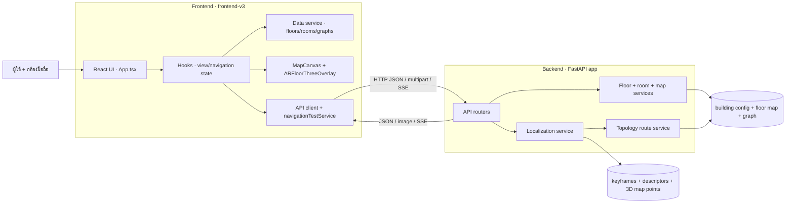
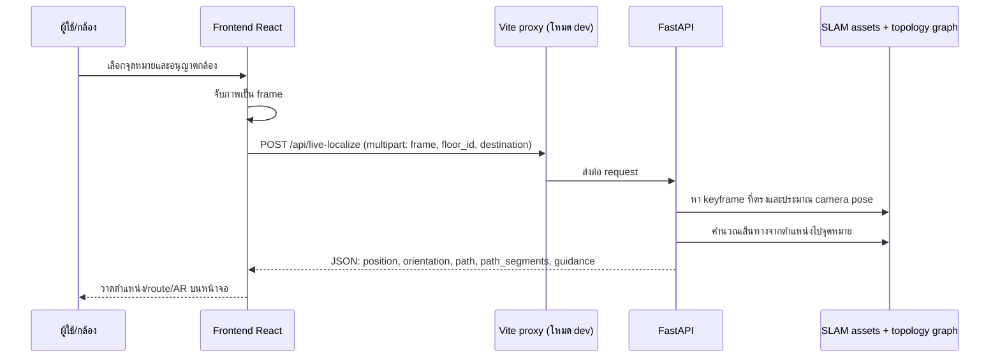

# Web architecture: Frontend ↔ Backend

เอกสารนี้อธิบายเว็บนำทางตอนเปิดใช้งานจริง: frontend รับ input จากผู้ใช้/กล้อง, เรียก backend ผ่าน HTTP, แล้วแสดงผลลัพธ์บนแผนที่หรือ AR. งานสร้างแผนที่ด้วย SLAM และแก้กราฟเป็นงานเตรียมข้อมูลแยกต่างหาก; ในเว็บ runtime ทั้งสองฝั่งอ่านผลลัพธ์ที่เตรียมไว้.

## ภาพรวมระบบ

## Frontend ทำอะไร

`frontend-v3` เป็น React + TypeScript + Vite. `App.tsx` ประกอบหน้าจอและควบคุม flow หลัก เช่น เลือกจุดหมาย เปิดกล้อง และเริ่ม/หยุดนำทาง. Hooks แยก state ของข้อมูลแผนที่ (`useNavigationData`) และ route-planning (`useRoutePlanning`).

- `navigationDataService.ts` โหลด floors, map metadata และ per-floor graph แล้วแปลงเป็นข้อมูลที่หน้าจอใช้. การ preview route คำนวณใน browser จาก topology graph.
- `MapCanvas.tsx` วาด floor plan, route และ markers. `ARFloorThreeOverlay.tsx` แสดง overlay บนภาพกล้อง.
- `navigationTestService.ts` จัดการ API สำหรับ live localization และ video navigation. `api/client.ts` สร้าง API URL.
- Frontend ไม่รัน SLAM และไม่ได้รับ keyframe database; มันส่งภาพจากกล้อง แล้ววาดตำแหน่ง/เส้นทางที่ backend ตอบกลับ.

## Backend ทำอะไร

`backend/app` เป็น FastAPI server. ตอนเริ่มระบบอ่าน `app/data/config/building.json`, โหลด graph ของชั้น และเตรียม localizer ที่ใช้ SLAM/keyframe assets. `/healthz` รายงานว่า backend และโมเดลพร้อมหรือยัง.

- `app/api/floors.py` ให้ข้อมูลชั้น (`/api/floors`), จุดหมาย (`/api/rooms`) และภาพผัง (`/api/map-image`).
- `app/api/localization.py` รับภาพและทำ localization ผ่าน `/api/live-localize`.
- `app/services/nav_service.py` คำนวณ route บน topological graph ที่ backend โหลดไว้.
- `app/api/navigation.py` และ `app/services/video_processor.py` รองรับ flow นำทางจากวิดีโอที่อัปโหลด โดยส่ง event ผ่าน SSE.

## การรับส่งข้อมูลหลัก

### เปิดเว็บและโหลดแผนที่

1. Frontend โหลด `/system_data/config/building.json`, `json_map/floorN.json` และภาพผังจาก `public/system_data/`.
2. หากตั้ง `VITE_API_BASE_URL`, frontend จะเรียก `/api/floors` และ `/api/rooms?all=1` เพื่อ overlay ข้อมูลชั้น/จุดหมายจาก backend และใช้ `/api/map-image` สำหรับภาพผัง.
3. ถ้าไม่ตั้ง `VITE_API_BASE_URL`, รายการชั้น/จุดหมาย/ภาพผังจะมาจาก static files ใน frontend; แต่ API สำหรับ localization ยังเรียกผ่าน `/api/...` ได้.

### นำทางด้วยกล้องสด

API response ของ live localization เป็น JSON; map image เป็น image response. ถ้าระบบยังไม่พร้อมหรือหา pose ไม่ได้ backend ส่งสถานะ/error ให้ frontend จัดการ retry หรือแสดงสถานะ lost.

### นำทางจากวิดีโอที่อัปโหลด

Frontend ส่งวิดีโอไป `POST /api/upload-video`, เริ่ม session ด้วย `POST /api/start-navigation`, แล้วรับผลต่อเนื่องจาก `GET /api/navigation-stream` (SSE). หาก SSE ใช้ไม่ได้ มี `GET /api/navigation-state` สำหรับ polling; จบ session ด้วย `POST /api/stop-navigation`.

## URL และ transport ระหว่าง frontend/backend

- **โหมดพัฒนาในเครื่อง:** ถ้าไม่ตั้ง `VITE_API_BASE_URL`, frontend เรียก same-origin `/api/...`; Vite proxy ส่ง `/api` และ `/uploads` ไป `http://127.0.0.1:5000`.
- **เรียก backend โดยตรง:** ตั้ง `VITE_API_BASE_URL` ให้เป็น base URL ของ backend; browser จะเรียก URL นั้นโดยตรง.
- **ข้อมูลที่ส่ง:** GET endpoints ใช้ query string; floor/rooms เป็น JSON; ภาพกล้องและวิดีโอส่งเป็น `multipart/form-data`; ผล live localization เป็น JSON; video session ใช้ SSE.

## ขอบเขตและจุดเชื่อมต่อข้อมูลแผนที่

| ส่วน | ใช้ข้อมูลอะไร | ที่อยู่ใน repo ปัจจุบัน |
|---|---|---|
| Frontend | floor config, floor graph, floor-plan image | `frontend-v3/public/system_data/` |
| Backend | floor config, floor graph, floor-plan image, SLAM/keyframe assets | `backend/app/data/` |
| Admin/preparation | ต้นทางที่ใช้สร้างและแก้ map data | โดยปกติ `navigate_indoor/` ผ่าน `visualize/apps/align-tool` |

จุดที่ควรระวังคือ frontend route preview ใช้กราฟที่โหลดจาก static files ส่วน live route คำนวณจากกราฟที่ backend โหลด. Backend map image และ static frontend map ก็เป็นคนละสำเนาได้. หากแก้ข้อมูลแล้ว deploy ไม่ sync ครบ หน้าพรีวิวอาจไม่ตรงกับ route/ตำแหน่งจริง. ควรระบุขั้นตอน publish/sync จาก admin data ไปยัง backend และ frontend ให้แน่นอน หรือย้ายการคำนวณ route preview ให้ backend เป็นผู้คำนวณแหล่งเดียว.

## จุดเริ่มอ่านโค้ด

- Frontend entry/state: `frontend-v3/src/App.tsx`, `frontend-v3/src/hooks/useNavigationData.ts`, `frontend-v3/src/hooks/useRoutePlanning.ts`
- Frontend data/network: `frontend-v3/src/api/client.ts`, `frontend-v3/src/services/navigationDataService.ts`, `frontend-v3/src/services/navigationTestService.ts`
- Frontend rendering: `frontend-v3/src/components/MapCanvas.tsx`, `frontend-v3/src/components/ARFloorThreeOverlay.tsx`
- Backend API/data: `backend/app/api/floors.py`, `backend/app/api/localization.py`, `backend/app/api/navigation.py`, `backend/app/services/floor_service.py`, `backend/app/services/nav_service.py`
- Dev proxy: `frontend-v3/vite.config.ts`
