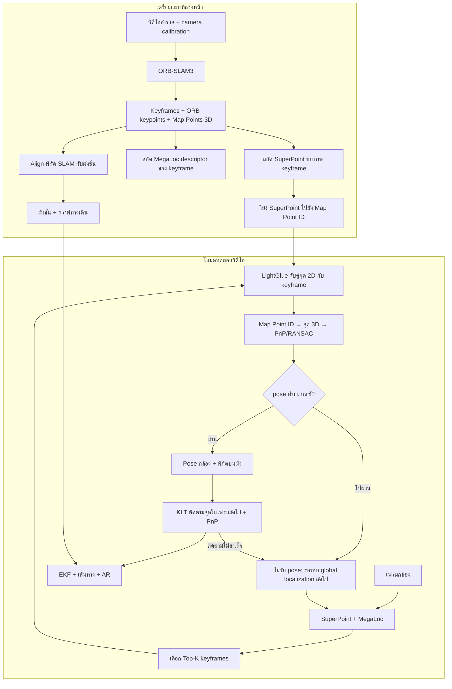

# Workflow ระบุตำแหน่งและนำทางด้วยภาพ

เอกสารนี้อธิบายแกน localization ของ `WebNav_front_back/backend/app` ในโหมดเร่งที่เปิดเป็นค่าเริ่มต้น (`NAV_ACCEL=1`): **MegaLoc + SuperPoint + LightGlue + PnP**. ส่วน **KLT + PnP + EKF** ที่อธิบายด้านล่างเป็น workflow ของ **โหมดทดสอบวิดีโอ** (`video_processor.py`). กล้องสดใน `frontend-v3/src/App.tsx` ส่งภาพนิ่งเป็นรอบไปยัง `/api/live-localize` ซึ่งทำ global localization ต่อคำขอและไม่ได้ใช้ KLT/EKF ของโหมดวิดีโอ. ตัวเลขในเอกสารเป็นค่าเริ่มต้นของโค้ด; ตัวแปรแวดล้อมและ config เปลี่ยนได้

## ภาพรวม

## 1. เตรียมแผนที่: ทำก่อนผู้ใช้เดิน

1. **สำรวจพื้นที่และสร้างแผนที่สามมิติ** — วิดีโอและ calibration ของกล้องเข้า ORB-SLAM3 เพื่อสร้าง keyframes, 3D Map Points และความสัมพันธ์ว่า ORB keypoint ใดเห็น Map Point ID ใด. `camera.yaml` เก็บ intrinsics ของกล้องที่ใช้สร้างแผนที่
2. **สร้างฐาน SuperPoint** — รัน SuperPoint บนภาพ keyframe เดิม แล้วให้แต่ละ SuperPoint keypoint รับ Map Point ID ของ ORB keypoint ที่มี ID ใช้ได้และอยู่ใกล้ที่สุดในภาพเดียวกันภายใน **5 px**. ถ้าไม่มีจะเก็บ `-1`. การโยงนี้อาศัยตำแหน่งพิกเซล ไม่ได้เปรียบเทียบ descriptor และไม่ได้บังคับความเป็นหนึ่งต่อหนึ่ง. ผลอยู่ใน `keyframes_superpoint/` พร้อม keypoints, descriptors, scores และ `mappoint_ids.npy`
3. **สร้างดัชนีค้นภาพ** — สกัด MegaLoc global descriptor ของ keyframes ไว้ใน `global_descriptors_megaloc.npy`. ขั้นนี้ต้องทำแยกจาก wizard สร้าง/align แผนที่ตามสถานะที่บันทึกไว้ใน `visualize/apps/align-tool/docs/ADMIN-REALWORLD-AUDIT.md`
4. **ผูกโลกสามมิติกับผังอาคาร** — alignment matrix และค่าชดเชยชั้นใช้แปลงตำแหน่งกล้องจากพิกัด SLAM เป็นพิกัดพิกเซลบน floor plan. กราฟทางเดินเป็นข้อมูลอีกชุดสำหรับหาทางไปยังปลายทาง

## 2. เริ่ม session: โหลดแผนที่และตั้งกล้อง

`Localizer` โหลด `camera.yaml`, 3D Map Points, keyframes ของ SuperPoint, MegaLoc descriptors, alignment และกราฟทางเดิน. ถ้าไม่ได้ปักชั้นไว้ ระบบพยายามอนุมานชั้นเริ่มต้นจากวิดีโอ. โหมดเร่งเริ่มต้นเปิดอยู่และใช้ LightGlue เป็น matcher. `camera.yaml` เป็นค่า intrinsics **ตั้งต้น** ของ query; ตัว self-calibrator อาจประมาณ focal จากคู่จุด 2D–3D ด้วย P4Pf ในช่วงต้น session แล้วล็อกเมื่อได้ค่าที่สอดคล้องกัน จึงไม่ได้ประมาณ focal ใหม่ทุกเฟรม

## 3. Global localization: หา pose ที่ยึดกับแผนที่

1. จากเฟรม query สกัด **SuperPoint** เพื่อได้จุดภาพและ descriptor เฉพาะจุด และสกัด **MegaLoc** เพื่อได้ descriptor ทั้งภาพ
2. MegaLoc เปรียบเทียบกับฐานข้อมูลเพื่อเลือก keyframes ที่น่าจะอยู่บริเวณเดียวกัน. โหมดเร่งใช้ **Top-K = 4** โดยค่าเริ่มต้น (`NAV_ACCEL_TOPK` เปลี่ยนได้; config พื้นฐานตั้งไว้ 10). คะแนน retrieval ใช้จัดลำดับ candidate ไม่ใช่หลักฐานยอมรับ pose และไม่มี score threshold แยกในเส้นทางนี้
3. **LightGlue** จับคู่ SuperPoint จุดใน query กับจุดในแต่ละ candidate. จากจุดฝั่ง keyframe อ่าน `mappoint_ids.npy` แล้วเปิดพิกัด 3D ของ Map Point นั้น จึงได้คู่ **จุดภาพ 2D ↔ จุดแผนที่ 3D** สำหรับ PnP
4. **PnP + RANSAC** คำนวณตำแหน่งและทิศกล้องจากคู่จุด โดยใช้ intrinsics ของ query ที่ active อยู่. รับ pose เมื่อมี inliers อย่างน้อย **10**, inlier ratio อย่างน้อย **0.15**, RANSAC reprojection threshold **8 px**, median reprojection error ไม่เกิน **9 px** และตำแหน่งผ่านการตรวจขอบเขตแผนที่. หากมีหลาย candidate ที่ผ่าน จะเลือกตาม quality score จากจำนวน/สัดส่วน inliers และ reprojection error
5. แปลง pose 3D เป็นจุด `(x, y)` บน floor plan ด้วย alignment. ผลสำเร็จยังส่งคู่จุด 2D–3D กลับภายในโปรเซสเพื่อเริ่มการติดตามต่อเนื่อง

## 4. ติดตามระหว่างรอบ global localization ในโหมดทดสอบวิดีโอ

Global localization ใช้เวลามาก จึงร้องขอตามรอบเวลาที่กำหนดและทำใน background worker. ระหว่างนั้นเฟรมวิดีโอที่เข้ามาถูกประมวลผลต่อเนื่อง (วิดีโอ 60 FPS ถูกลดการประมวลผลลงใกล้ 30 FPS โดยคง timestamp เดิม):

1. **KLT / Lucas–Kanade optical flow** ติดตามพิกัด 2D ของจุดที่รู้ตำแหน่ง 3D แล้วจากเฟรมก่อนมายังเฟรมปัจจุบัน พร้อม forward/backward check และตรวจว่าจุดยังอยู่ในภาพ
2. ใช้พิกัด 2D ใหม่กับ 3D Map Points เดิมทำ **PnP + RANSAC** อีกครั้ง จึงได้ pose ของ **เฟรมปัจจุบัน** ไม่ใช่แค่คัดลอก pose จากเฟรมที่เคย localize
3. ตรวจเกณฑ์คุณภาพเช่นเดียวกับ global pose. เมื่อ global localization รอบใหม่สำเร็จ ระบบตรวจผลกับเฟรมต้นทาง ไล่ติดตามจุดให้ทันเฟรมปัจจุบัน และผสานจุดที่ยืนยันแล้วเข้า track set
4. ถ้า track เหลือน้อยกว่า 4 จุด หรือ PnP ไม่ผ่าน ระบบรายงาน `tracking_lost` / `pose_rejected` และไม่รับ pose นั้น. Global localization ยังถูกขอตามรอบที่กำหนด; ถ้า track หายและ localization ชั้นปัจจุบันไม่สำเร็จ ระบบลองค้น candidate จากชั้นอื่นด้วย

เมื่อ tracking หลุดหรือ pose ถูกปฏิเสธต่อเนื่องครบ 3 เฟรมที่ประมวลผล ระบบจะสั่ง global localization ทันทีใน background; ถ้าไม่สำเร็จยังมีรอบตาม interval เดิมเป็น retry จึงไม่ควรสื่อว่าเริ่ม relocalize ทุกเฟรม

## 5. จาก pose ไปเป็นการนำทางและ AR

Pose ที่ผ่านเกณฑ์ถูกแปลงเป็นพิกัดผังชั้น. ใน **โหมดทดสอบวิดีโอ** ขั้น smoothing ใช้ **EKF** ตาม config ปัจจุบันเพื่อลดการกระโดดของตำแหน่ง/ทิศ ไม่ได้ใช้ EKF เพื่อเชื่อม SuperPoint กับ Map Points. ระบบหาจุดเริ่มบนกราฟทางเดิน คำนวณทางไปปลายทาง ติดตามความคืบหน้าบนเส้นทาง และส่งข้อมูลตำแหน่ง เส้นทาง ทิศเลี้ยว และเรขาคณิต AR ให้ frontend แสดงผล. เมื่อ pose ไม่มีความมั่นใจ การแสดง AR จะเข้าสู่สถานะ hold/hide ตามอายุของตำแหน่งล่าสุดและเหตุผลที่ tracking หลุด

## จุดที่ควรระบุในภาพ workflow

| กล่อง/ลูกศร | ข้อความที่ตรงกับโค้ด |
|---|---|
| Associate keypoints with Map Point IDs | Nearest valid ORB keypoint ≤ 5 px → transfer Map Point ID; otherwise `-1` |
| Retrieval | MegaLoc → Top-K keyframes (ค่าเริ่มต้นโหมดเร่ง: 4) |
| Geometric verification | LightGlue → 2D–3D correspondences → PnP/RANSAC → quality gate |
| Continuous tracking | KLT optical flow + PnP on current frame |
| Tracking lost | Reject pose → next scheduled global localization; try other floors when applicable |
| Camera intrinsics | Map `camera.yaml` initially → bounded P4Pf focal self-calibration → session focal |
| Smoothing | EKF after accepted localization/tracking pose |

## โค้ดอ้างอิง

- `navigate_indoor/extract/build_superpoint_database.py` — การโยง SuperPoint กับ ORB Map Point ID
- `app/localization_config.py`, `app/config.py`, `app/services/accel.py` — mode และ thresholds
- `app/core/localizer.py`, `app/core/localization.py` — โหลดฐานข้อมูล, retrieval, matching, PnP, แปลงพิกัด
- `app/core/self_calibration.py` — ประมาณ focal จากภาพและล็อกค่าใน session
- `app/services/video_processor.py`, `app/core/smoothing.py` — KLT/PnP, re-localization cadence, EKF, route และ AR
